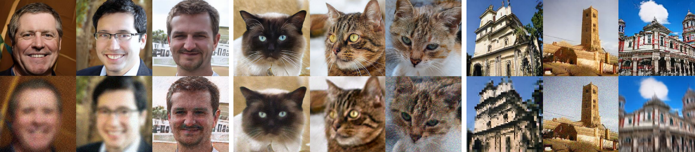

# Tune-QCIGM

Tune-QCIGM is a PyTorch implementation for **quality-controllable image generation, restoration, and semantic editing**. It extends a StyleGAN2-ADA generator with a quality code so that one content latent can produce a sharp image or a degraded version of the same image. The repository also combines pSp inversion, Pivotal Tuning Inversion (PTI), and InterfaceGAN directions for editing real, degraded inputs.



The repository contains the complete training and inference code, but pretrained checkpoints and datasets are not committed to the repository. The commands below therefore use paths that must be filled with locally downloaded checkpoints and prepared datasets.

## Research question

**Can a StyleGAN-based generator preserve image content while controlling visual quality, and can that representation support restoration and semantic editing of low-quality images?**

### Answer supported by this implementation

The code is designed to answer **yes, conditionally**:

- The generator maps a standard StyleGAN latent `z` to style latents `w` and passes an additional quality code `q` into the synthesis network.
- With the same `z` and label, changing `q` changes the generated quality while keeping the underlying content representation fixed.
- `generate.py` demonstrates this directly by writing a sharp image with `q=0` and a degraded image with a random `q` for every seed.
- Training uses a sharp-image discriminator, a degraded-image discriminator, and feature-level distillation from a teacher generator to retain content while learning the quality variation.
- For real images, pSp estimates the latent and quality codes, PTI adapts the generator to the input, and InterfaceGAN boundaries provide semantic edits such as smiling, age, gender, and eyeglasses.

This repository demonstrates the mechanism and workflow. It does not include a complete benchmark table or a bundled evaluation report, so quantitative claims should be made only after running the supplied metrics on a chosen dataset and checkpoint.

## What is included

| Component | Role | Main entry point |
| --- | --- | --- |
| Quality-conditioned StyleGAN2-ADA | Train and sample sharp/degraded images | `train.py`, `generate.py` |
| Dataset conversion | Convert image folders, ZIP files, LMDB, or supported archives | `dataset_tool.py` |
| Evaluation | Compute FID and other registered metrics | `calc_metrics.py` |
| pSp inversion | Estimate latent and quality codes for input images | `restoration/pSp/scripts/inference.py` |
| PTI inversion | Tune generator weights for a particular input | `restoration/PTI/inversion.py` |
| Semantic editing | Move latent codes along InterfaceGAN boundaries | `editing/edit.py` |

## Repository layout

```text
Tune-QCIGM/
├── train.py                 # Quality-conditioned GAN training
├── generate.py              # Sharp and degraded image generation
├── calc_metrics.py          # Metric evaluation
├── dataset_tool.py          # Dataset preparation
├── training/                # Generator, loss, dataset, and training loop
├── metrics/                 # FID, KID, precision/recall, and related metrics
├── restoration/
│   ├── pSp/                 # Encoder-based inversion
│   └── PTI/                 # Per-image generator tuning
├── editing/                 # InterfaceGAN-based semantic manipulation
├── pretrained_models/       # Expected location for local checkpoints
└── assets/teaser.png        # Checked-in qualitative result image
```

## Installation

The code targets the older PyTorch/CUDA stack pinned in `requirements.txt` (`Python 3.7`, `PyTorch 1.7.1`, and compatible CUDA). A Linux or WSL environment is recommended because the project compiles custom CUDA extensions. Native Windows can require Visual Studio C++ build tools and a CUDA toolkit that matches the installed PyTorch build.

```bash
git clone https://github.com/hassaan4717/Tune-QCIGM.git
cd Tune-QCIGM

conda create -n tune-qcigm python=3.7.3
conda activate tune-qcigm
pip install -r requirements.txt
```

Verify that CUDA is visible before running a model:

```bash
python -c "import torch; print(torch.__version__); print(torch.cuda.is_available())"
```

The first model run may compile the custom operators in `torch_utils/ops`. On Windows, run from a Visual Studio developer environment if compilation cannot find a C++ compiler.

## Checkpoints and data

Place downloaded checkpoints under `pretrained_models/`, or pass absolute paths to the command-line options. The codebase expects variants such as:

- a quality-conditioned generator pickle, for example `ffhq_256x256.pkl`;
- a teacher generator checkpoint, for example `G_teacher_FFHQ_256x256.pth.tar`;
- a pSp checkpoint, for example `ffhq_psp.pt`;
- encoder dependencies such as `model_ir_se50.pth` when required by the selected pSp configuration.

Training data should be converted to the uncompressed-image ZIP format used by StyleGAN2-ADA. For example:

```bash
python dataset_tool.py \
    --source=/path/to/images \
    --dest=/path/to/datasets/ffhq256.zip \
    --width=256 --height=256
```

For a center-cropped LSUN-style dataset:

```bash
python dataset_tool.py \
    --source=/path/to/lsun/church_lmdb \
    --dest=/path/to/datasets/lsunchurch.zip \
    --transform=center-crop --width=256 --height=256
```

## Generate images

`generate.py` requires a generator pickle and a CUDA device. For each seed it writes two files: `seedXXXX.png` for the sharp output and `seed_degraded_XXXX.png` for the output generated with a different quality code.

```bash
python generate.py \
    --network=./pretrained_models/ffhq_256x256.pkl \
    --outdir=out/generation \
    --trunc=1 \
    --seeds=85,265,297,849
```

For conditional models, provide the class index with `--class`. Other supported options include `--noise-mode const|random|none` and `--projected-w FILE`.

## Train a quality-conditioned generator

The training script accepts a dataset ZIP and a teacher checkpoint. `--q_dim` controls the dimensionality of the quality code. The preset names select resolution-specific StyleGAN2 settings:

| Preset | Intended resolution |
| --- | --- |
| `paper256` | 256 x 256 face data |
| `paper512` | 512 x 512 data |
| `church256` | 256 x 256 church data |
| `auto` | Automatically selected settings |

Example for a single-GPU smoke run with a short duration:

```bash
python train.py \
    --outdir=training-runs \
    --data=/path/to/datasets/ffhq256.zip \
    --gpus=1 \
    --cfg=auto \
    --q_dim=16 \
    --batch=4 \
    --kimg=100 \
    --teacher_ckpt=./pretrained_models/G_teacher_FFHQ_256x256.pth.tar
```

For a larger FFHQ-style run, use a power-of-two GPU count and a matching batch size:

```bash
python train.py \
    --outdir=training-runs \
    --data=/path/to/datasets/ffhq256.zip \
    --gpus=8 \
    --cfg=paper256 \
    --q_dim=16 \
    --batch=64 \
    --resume=./pretrained_models/network-pretrained-FFHQ-256x256.pkl \
    --teacher_ckpt=./pretrained_models/G_teacher_FFHQ_256x256.pth.tar
```

Training creates a run directory containing logs, image snapshots, network pickles, and metric records. Use `--metrics=none` to disable metrics during training, or change `--snap` to control snapshot frequency.

## Evaluate a checkpoint

The repository includes FID, KID, inception score, perceptual path length, and precision/recall implementations. A typical FID command is:

```bash
python calc_metrics.py \
    --metrics=fid50k_full \
    --data=/path/to/datasets/ffhq256.zip \
    --network=./pretrained_models/ffhq_256x256.pkl
```

The resulting score is printed to the terminal. Always report the dataset, checkpoint, resolution, and metric configuration with a result.

## Restore a low-quality image

Restoration is a three-stage process. The input directory should contain images compatible with the selected pSp dataset configuration.

### 1. Estimate latent and quality codes with pSp

```bash
cd restoration/pSp
python scripts/inference.py \
    --out_path=/path/to/results \
    --checkpoint_path=../../pretrained_models/ffhq_psp.pt \
    --data_path=/path/to/input_images \
    --stylegan_weights=../../pretrained_models/ffhq_256x256.pkl \
    --test_batch_size=4 \
    --test_workers=4
```

This creates `inverted/`, `org/`, and `latent/` directories under the output path. Each latent stores the content code and quality code used by the quality-conditioned generator.

### 2. Tune the generator with PTI

Run from the PTI directory and point `--image_dir` and `--latent_dir` to the corresponding pSp outputs:

```bash
cd ../PTI
python inversion.py \
    --network=../../pretrained_models/ffhq_256x256.pkl \
    --image_dir=/path/to/results/org \
    --latent_dir=/path/to/results/latent \
    --save_dir=/path/to/results \
    --gen_degraded
```

PTI writes per-input tuned model checkpoints and reconstruction outputs below the configured save directory.

### 3. Edit the restored image

The repository includes boundaries in `editing/boundaries/`, including age, eyeglasses, gender, and smiling directions. Use a latent directory from pSp and tuned model directory from PTI:

```bash
cd ../../editing
python edit.py \
    --input_latent_codes=/path/to/results/latent \
    --models_path=/path/to/results/models \
    --boundary_path=boundaries/smiling_boundary.npy \
    --output_dir=/path/to/results/smiling \
    --latent_space_type=W \
    --start_distance=-3 \
    --end_distance=3 \
    --steps=10
```

The editor saves interpolated edited images and corresponding sharp synthesis results. The current script selects the first sorted latent/model pair from the supplied directories, so process samples individually when deterministic per-image output is required.

## Reproducibility notes

- Use the same image resolution, generator checkpoint, pSp checkpoint, and dataset configuration across all stages.
- Keep the quality-code dimension (`q_dim`) consistent between training, inversion, and inference checkpoints.
- The custom CUDA operators are compiled on first use and may need a writable cache directory.
- Large-scale training is GPU-intensive; the included presets are not a guarantee that a run will fit on a particular GPU.
- Checkpoint files, datasets, and generated outputs are intentionally excluded from this repository.

## Acknowledgements

This repository incorporates components from the StyleGAN2-ADA, pSp, PTI, and InterfaceGAN codebases. Their licenses and notices are retained in the corresponding source directories. Review those files before redistributing modified code or pretrained weights.

## License

See [LICENSE](LICENSE) and the license notices in the vendored subdirectories.

## Citation and contact

For implementation questions, please open an issue at [github.com/hassaan4717/Tune-QCIGM](https://github.com/hassaan4717/Tune-QCIGM). When publishing results produced with this code, cite the relevant upstream methods and datasets used in your experiment.
